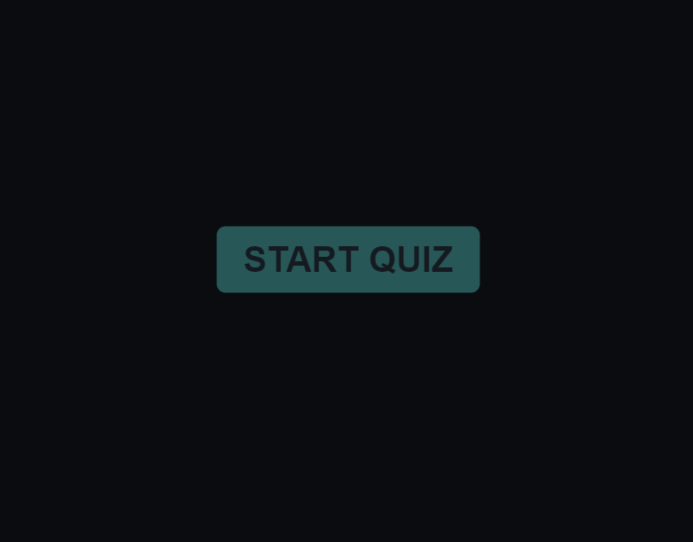

# Code Quiz

User starts the quiz and has 5 minutes to finish the quiz. Once player hits start quiz will display rules to the quiz and time limits. Any time user guesses correctly box will flash green and any time user gets answer wrong box will flash red and 30 seconds will be detracted from remaining time. User has the option to save their score and will store to local storage to be retrieved so High Scores can be compared for future run.

## Demo

## Lessons Learned

This project was more challenging than I thought it would be. The designing alone took a full day. However, the experience was extremely rewarding and I am getting that much better with CSS and HTML for designing purposes. The javascript was easy in some parts and hard in some parts. There was a lot of trial and error in determining in which iteration I needed to invoke what function to trigger proper timing so the quiz would behave like I wanted it to. Overall, very satisfied with work as I can see the improvements I am making.
  
## Deployment

https://eccentricality.github.io/codeQuiz/

  